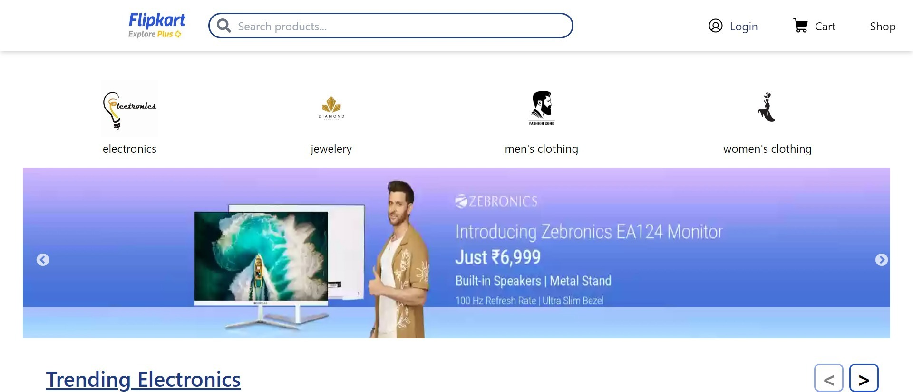
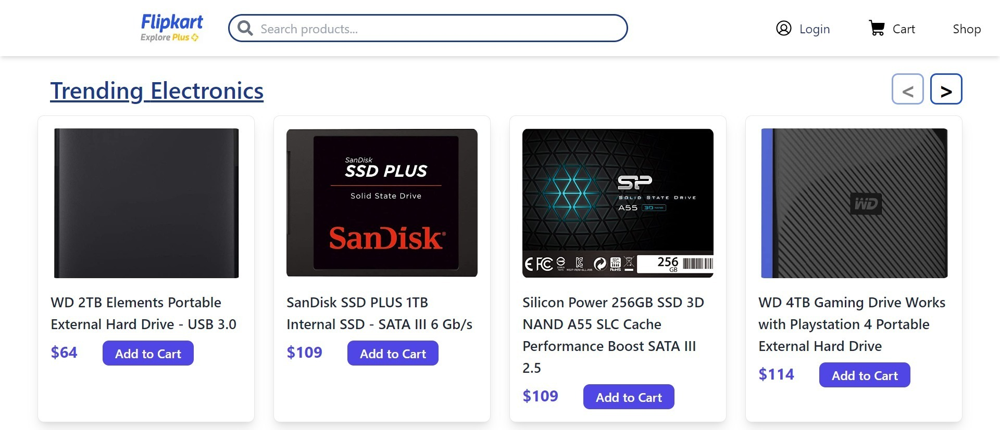
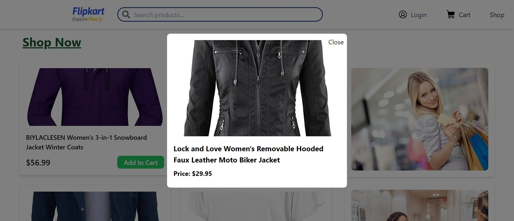
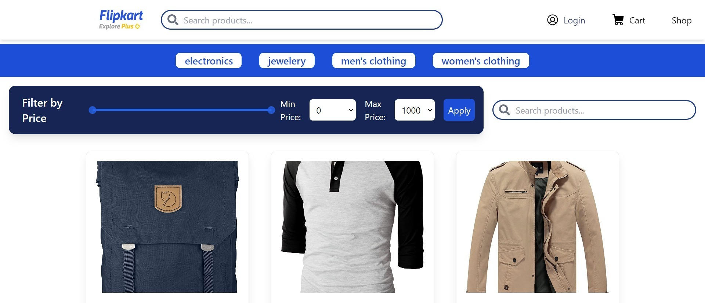
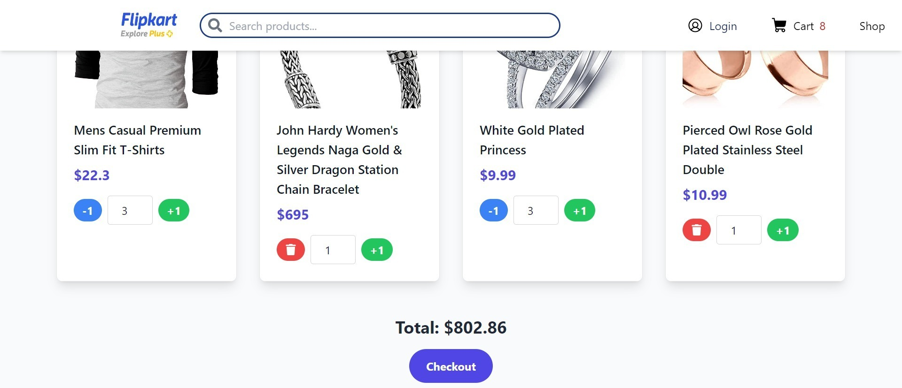
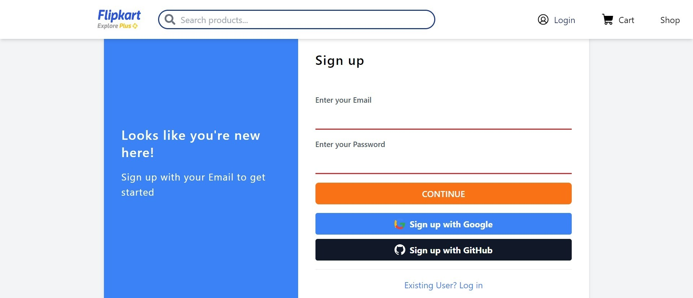
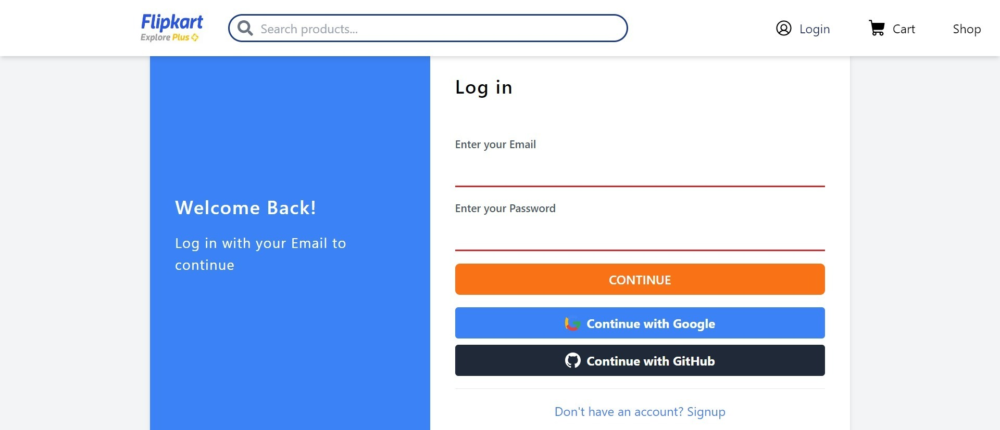
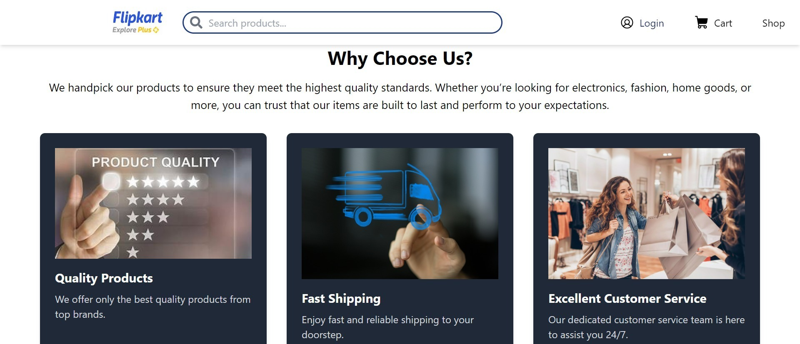
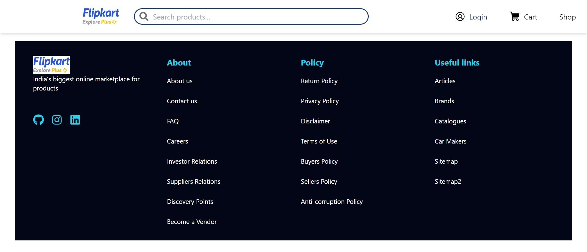

## 💫`flipkart`
  Flipkart is an e-commerce platform where users can browse, select, and purchase products to fulfill their wishes. The website offers a seamless and responsive shopping experience, allowing users to easily navigate through different product categories and manage their shopping cart. To make a purchase, users must sign up and log in to the platform.

## Features:

Category Selection: Users can browse products by category, such as furniture, and add multiple items to their cart.
Responsive Design: The website provides a seamless experience across various devices.
Cart Management: Users can view and manage the items in their cart before making a purchase.

## Main pages of the project

# Home page


# homepage


# Home page


# products


# Cart


# signup


# Login


# why choose us


# Footer



##  🌿 `Project Folder Structure`
1. [src/app.js]  in this page all the components are imported and applied Routes
2.[src/index.js]  for managing the whole the website.
3. [src/components]  in this file all the dependency are their .
4. [src/ui] here the ui of about ,searchbar,footer are availbale.
5. [src/Redux] redux file are available here
6. [src/filter] services of API  is available here.
7. [src/firebase] firebase connection file is available here.


## 🌐 `Languages and Tools used`
  - React + Vite:-Javasript library which used to make Ui.
  - Redux:-Redux is state management tool for manage state.
  - React-Router:- for Routing go to different pages
  - Tailwind Css:- Utility Css frameWork which used for styling the webapge of the wishWebApp and make responsive Project.
  - React icons: we use react-icons because for icons.
  - Authentication : firebase authentication 


## 🔧 `Project Clonning and Running`
- To run this project locally, use the following command in your CLI:
- 1. Clone this repository:

```bash
  https://github.com/jyotipatthak/flipkart
```

2. Install dependencies:

```bash
 npm i
```

3. Start the application:

```bash
 npm run dev
```
- Go to any Browser and search localhost:3000

## ✨`Deployment`

**Link of gitgub page** : https://github.com/jyotipatthak/flipkart

**Link of flipkart  app video**: https://youtu.be/MKEkv8dHDyA?si=jMhwehTvKdMSc9ms

**Web Deployed Link**: https://flipkart-eight-eta.vercel.app


# backend 


This is a backend application for a shopping platform similar to Flipkart. The backend is built with Node.js, Express, and MongoDB.

## Table of Contents

- [Installation](#installation)
- [Running the Application](#running-the-application)
- [API Documentation](#api-documentation)
- [Project Structure](#project-structure)
- [Environment Variables](#environment-variables)
- [Contributing](#contributing)
- [License](#license)

## Installation

1. Clone the repository:

    ```bash
    git clone https://github.com/yourusername/flipkart-main.git
    cd flipkart-main/backend
    ```

2. Install dependencies:

    ```bash
    npm install
    ```

3. Create a `.env` file in the root of the `backend` directory and add the following environment variables:

    ```plaintext
    PORT=8000
    MONGO_URI=your_mongodb_connection_string
    JWT_SECRET=your_jwt_secret
    ```

## Running the Application

1. Start the server:

    ```bash
    npm run dev
    ```

## API Documentation

The API documentation is generated using Swagger. After starting the server, you can access the API documentation at:

http://localhost:8000/api-docs


## Project Structure

```plaintext
flipkart-main/
├── backend/
│   ├── src/
│   │   ├── config/
│   │   │   └── db.js
│   │   ├── controllers/
│   │   │   ├── user.controller.js
│   │   │   ├── order.controller.js
│   │   │   ├── category.controller.js
│   │   │   └── product.controller.js
│   │   ├── middlewares/
│   │   │   └── user.middleware.js
│   │   ├── models/
│   │   │   ├── user.model.js
│   │   │   ├── order.model.js
│   │   │   ├── category.model.js
│   │   │   └── product.model.js
│   │   ├── routes/
│   │   │   ├── user.routes.js
│   │   │   ├── order.routes.js
│   │   │   ├── category.routes.js
│   │   │   └── product.routes.js
│   ├── swagger.js
│   ├── index.js
├── package.json
├── ...other file
```


## Contributing :
Contributions are welcome! Please open an issue or submit a pull request.

## Description of Directories:

config/: Contains the database configuration file.
controllers/:
  . user.controller.js: User-related operations.
  . order.controller.js: Order-related operations.
  . category.controller.js: Category-related operations.
  . product.controller.js: Product-related operations.
middlewares/:
  . user.middleware.js: Middleware for user authentication.
models/:
  . user.model.js: User schema.
  . order.model.js: Order schema.
  . category.model.js: Category schema.
  . product.model.js: Product schema.
routes/:
  . user.routes.js: Routes for user operations.
  . order.routes.js: Routes for order operations.
  . category.routes.js: Routes for category operations.
  . product.routes.js: Routes for product operations.
swagger.js: Contains the Swagger configuration for API documentation.
index.js: Entry point of the application.

## 🎋 `COLLABORATORS`
This project is created by :
- [@jyoti pathak](https://github.com/jyotipatthak)

##  📚`Feedback`

If you have any feedback, please reach out to us at jyotipathak604@gmail.com

